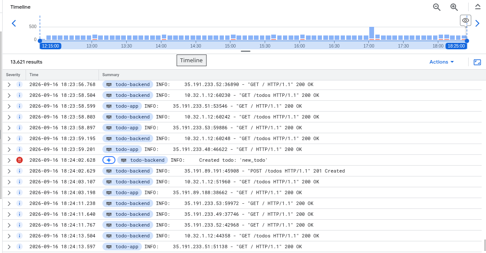
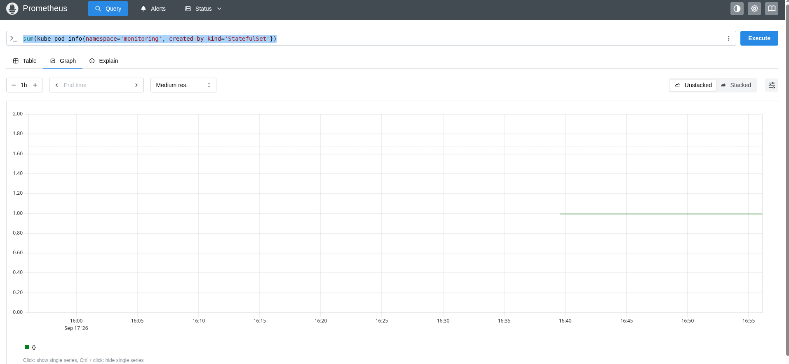

# KubernetesSolutions

My exercise solutions for the University of Helsinki
[DevOps with Kubernetes 2026](https://courses.mooc.fi/org/uh-cs/courses/devops-with-kubernetes-2026)
course.

## Database: Cloud SQL or self-hosted Postgres

| | Cloud SQL (DBaaS) | Postgres in the cluster |
|---|---|---|
| **Setup** | Create the instance, grant access, point the app at it. No manifests. | StatefulSet, PVC and a headless Service — already written, and it runs anywhere. |
| **Cost** | A managed instance billed whether or not it is used, on top of the cluster. | Only the persistent disk; the nodes are already paid for. |
| **Maintenance** | Patching, minor upgrades and failover are Google's problem. | Ours: version upgrades, tuning, and a single replica with no failover. |
| **Backups** | Automated daily backups and point-in-time recovery, restored from the console or one command. | Nothing by default. Disk snapshots or a `pg_dump` CronJob, and a restore we have to write and test ourselves. |
| **Lock-in** | Tied to Google Cloud. | Runs on any cluster, including k3d locally. |

Backups are the honest dividing line: everything else is a matter of effort,
but an untested restore path is the thing that actually loses data. Cloud SQL
is the better default for anything that matters; the self-hosted setup is
cheaper, portable, and fine for this course.

## Logging

Application logs reach Google Cloud Logging, where both the request lines and
the backend's own messages are searchable — here a todo being created:



## Prometheus

Pods created by StatefulSets in the monitoring namespace:

```promql
sum(kube_pod_info{namespace='monitoring', created_by_kind='StatefulSet'})
```



`kube_pod_info` carries one series per pod, labelled with `created_by_kind`, so
filtering on that and summing gives the pod count.

## Exercises

### Chapter 2

- [1.1.](https://github.com/drellxor/KubernetesSolutions/tree/1.1/log_output)
- [1.2.](https://github.com/drellxor/KubernetesSolutions/tree/1.2/todo_app)
- [1.3.](https://github.com/drellxor/KubernetesSolutions/tree/1.3/log_output)
- [1.4.](https://github.com/drellxor/KubernetesSolutions/tree/1.4/todo_app)
- [1.5.](https://github.com/drellxor/KubernetesSolutions/tree/1.5/todo_app)
- [1.6.](https://github.com/drellxor/KubernetesSolutions/tree/1.6/todo_app)
- [1.7.](https://github.com/drellxor/KubernetesSolutions/tree/1.7/log_output)
- [1.8.](https://github.com/drellxor/KubernetesSolutions/tree/1.8/todo_app)
- [1.9.](https://github.com/drellxor/KubernetesSolutions/tree/1.9/ping_pong)
- [1.10.](https://github.com/drellxor/KubernetesSolutions/tree/1.10/log_output)
- [1.11.](https://github.com/drellxor/KubernetesSolutions/tree/1.11/log_output)
- [1.12.](https://github.com/drellxor/KubernetesSolutions/tree/1.12/todo_app)
- [1.13.](https://github.com/drellxor/KubernetesSolutions/tree/1.13/todo_app)

### Chapter 3

- [2.1.](https://github.com/drellxor/KubernetesSolutions/tree/2.1/log_output)
- [2.2.](https://github.com/drellxor/KubernetesSolutions/tree/2.2/todo_backend)
- [2.3.](https://github.com/drellxor/KubernetesSolutions/tree/2.3/log_output)
- [2.4.](https://github.com/drellxor/KubernetesSolutions/tree/2.4/todo_app)
- [2.5.](https://github.com/drellxor/KubernetesSolutions/tree/2.5/log_output)
- [2.6.](https://github.com/drellxor/KubernetesSolutions/tree/2.6/todo_app)
- [2.7.](https://github.com/drellxor/KubernetesSolutions/tree/2.7/ping_pong)
- [2.8.](https://github.com/drellxor/KubernetesSolutions/tree/2.8/todo_backend)
- [2.9.](https://github.com/drellxor/KubernetesSolutions/tree/2.9/todo_backend)
- [2.10.](https://github.com/drellxor/KubernetesSolutions/tree/2.10/todo_backend)

### Chapter 4

- [3.1.](https://github.com/drellxor/KubernetesSolutions/tree/3.1/ping_pong)
- [3.2.](https://github.com/drellxor/KubernetesSolutions/tree/3.2/log_output)
- [3.3.](https://github.com/drellxor/KubernetesSolutions/tree/3.3/ping_pong)
- [3.4.](https://github.com/drellxor/KubernetesSolutions/tree/3.4/ping_pong)
- [3.5.](https://github.com/drellxor/KubernetesSolutions/tree/3.5/todo_app)
- [3.6.](https://github.com/drellxor/KubernetesSolutions/tree/3.6/.github/workflows)
- [3.7.](https://github.com/drellxor/KubernetesSolutions/tree/3.7/.github/workflows)
- [3.8.](https://github.com/drellxor/KubernetesSolutions/tree/3.8/.github/workflows)
- [3.9.](https://github.com/drellxor/KubernetesSolutions/tree/3.9#database-cloud-sql-or-self-hosted-postgres)
- [3.10.](https://github.com/drellxor/KubernetesSolutions/tree/3.10/todo_backend/manifests)
- [3.11.](https://github.com/drellxor/KubernetesSolutions/tree/3.11/todo_app/manifests)
- [3.12.](https://github.com/drellxor/KubernetesSolutions/tree/3.12#logging)

### Chapter 5

- [4.1.](https://github.com/drellxor/KubernetesSolutions/tree/4.1/ping_pong)
- [4.2.](https://github.com/drellxor/KubernetesSolutions/tree/4.2/todo_app)
- [4.3.](https://github.com/drellxor/KubernetesSolutions/tree/4.3#prometheus)
- [4.4.](https://github.com/drellxor/KubernetesSolutions/tree/4.4/ping_pong/manifests)
